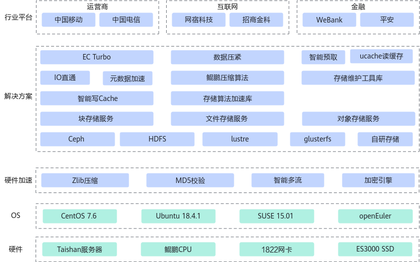

# Boostsds导流仓总体介绍

## 最新消息

- \[2025年12月]：元数据加速特性，RocksDB 6.1.2性能提升。
- \[2025年03月]：新增元数据加速特性。
- \[2025年03月]：新增SPDK IO加速特性。
- \[2024年12月]：KSAL新增面向Ceph百亿对象存储元数据压缩场景的zstd压缩算法。
- \[2024年12月]：KSAL优化6+3配比、条带为64Byte粒度的编解码。
- \[2024年12月]：新增EC Turbo调优特性。
- \[2024年09月]：新增RDMA网络加速特性。
- \[2024年09月]：新增KAE使能SPDK特性。
- \[2024年09月]：KSAL EC算法新增支持K+1、K+2、K+3、K+4（2≤K≤25）、28+3配比、条带为64Byte和4096Byte粒度的编解码。
- \[2024年06月]：KSAL增加EC 8+2/8+3/25+4等编码类型，相比开源版本的编码性能提升50+%。
- \[2024年01月]：KSAL EC算法新增支持条带为64Byte粒度的编解码。
- \[2023年10月]：新增存储加速算法库（KSAL）特性，支持EC算法、CRC16 T10DIF算法和CRC32C算法。

## 项目介绍

1.1 概述

鲲鹏BoostKit分布式存储场景（简称鲲鹏BoostKit分布式存储），以鲲鹏硬件平台为底座，依托鲲鹏硬件的自研处理器、网卡、SSD、管理芯片、AI芯片的全方位整体优势，结合开源Ceph分布式存储软件，为客户提供块存储、文件存储、对象存储服务。鲲鹏BoostKit分布式存储总体架构主要由硬件平台、操作系统、中间件、分布式存储软件构成，其中分布式存储软件当前只支持开源Ceph。

1.2 架构图

1.3 社区主页

[鲲鹏社区-鲲鹏BoostKit分布式存储场景](https://www.hikunpeng.com/document/detail/zh/kunpengsdss/overview/kunpengsdss.html)。

## 特性介绍

### EC Turbo

- 鲲鹏BoostKit分布式存储EC Turbo特性是针对开源Ceph的EC流程进行优化，降低了数据读写流程中，I/O放大比例，整体性能更高。EC Turbo特性性能相对于Ceph开源EC，提升30%以上。
- [https://gitcode.com/boostkit/ceph](https://gitcode.com/boostkit/ceph)

### 存储算法加速库

鲲鹏BoostKit分布式存储算法加速库是华为自研的存储算法加速库，采用鲲鹏优化的算法代替主流开源算法，提升存储性能。

- EC编解码
  - 采用向量化EC编解码方案，以低阶二元XOR操作替代传统标量编码的高阶有限域乘法，配合编码调度，复用中间计算结果减少操作数。
  - 对比主流开源EC算法，编码平均吞吐性能提升100%。
- CRC16校验
  - 采用大数求余算法原理优化以及鲲鹏亲和优化的CRC16库替代系统标准CRC16校验算法，提升系统性能。
  - 对比主流开源CRC16算法，4K校验性能提升100%。
- CRC32校验 
  - 采用鲲鹏优化的CRC32库替代系统标准CRC32校验算法，提升系统性能。
  - 单个I/O消耗CPU的算力减少50%以上，整体收益预计3%。在4KB、8KB、64KB、256KB和1MB块大小情况下，相比ceph_crc32c_sctp性能提升100%，相比ceph_crc32_sctp提升20%。
- \[待开源]

### 元数据加速

- 鲲鹏BoostKit元数据加速特性是华为自主研发，在RocksDB基础上优化后的存储引擎性能加速特性。
  - RocksDB：
    RocksDB起源于Facebook，是一款高性能、持久化的嵌入式kv（key value）存储引擎，广泛应用于各种大规模数据存储和处理场景，如互联网服务、分布式系统和数据分析等。元数据加速特性在RocksDB项目的基础上，结合华为自研算法进行了性能加速优化，在使能鲲鹏加速特性时可以获取更佳的性能。主要优化内容包括：深度融合鲲鹏架构优化读写热点、结合业务负载调整后台任务（flush、compaction）、结合数据热点优化缓存逻辑等。
  - [https://gitcode.com/boostkit/rocksdb](https://gitcode.com/boostkit/rocksdb)

### Ucache智能读缓存

- 鲲鹏BoostKit Ucache智能读缓通过I/O智能预取精准识别热点请求，并针对顺序、间隔等I/O流进行I/O预取，将I/O提前载入读缓存。通过LRU算法淘汰冷数据，Ucache读缓存能够提高缓存的I/O命中率，提升读性能。
- [https://gitcode.com/boostkit/ocf](https://gitcode.com/boostkit/ocf)

### 数据压紧

- 鲲鹏BoostKit分布式存储数据压紧算法部署在开源分布式存储集群Ceph上，通过消除补零对齐操作带来的数据浪费问题，结合压紧封装、空间计数分配、粒度分流、聚合提交、批量回调等手段提升数据缩减率并提升系统整体IOPS，实现成本性能双收益。
- [https://gitcode.com/boostkit/ceph](https://gitcode.com/boostkit/ceph)

### RDMA网络加速

- 通过在Ceph网络框架AsyncMessage中新增插件支持UCX网络框架，实现Ceph全闪存场景支持网络全RDMA化。
- [https://gitcode.com/boostkit/ceph](https://gitcode.com/boostkit/ceph)

### KAE使能SPDK

- SPDK的BDEV设备作为虚拟设备层对接底层多种设备类型（虚拟设备、物理设备），通过在BDEV设备中使能压缩和加解密能够支持所有SPDK设备。
- [https://gitcode.com/boostkit/spdk](https://gitcode.com/boostkit/spdk)

### SPDK IO加速

- 在openEuler 20.03操作系统的鲲鹏服务器上容器化部署Ceph集群，并配置和优化SPDK、UCX、KSAL的集成，以实现存储与网络性能的最大化，满足现代分布式存储对高吞吐量、低延迟的需求。
- [https://gitcode.com/boostkit/ceph](https://gitcode.com/boostkit/ceph)

## 关于社区

提供社区治理架构、SIG组织运作章程、参与贡献、邮件订阅、社媒联系方式等公共模块内容简介和指引。

## 贡献、建议与交流

欢迎大家为社区做贡献，如果使用过程中有任何问题/建议，或者需要反馈特性需求和bug报告，可以提交[Issues](https://gitcode.com/boostkit/community/blob/master/docs/contributor/issue-submit.md)联系我们，具体贡献方法可参考[这里](https://gitcode.com/boostkit/community/blob/master/docs/contributor/contributing.md)。同时也欢迎大家在[讨论专区](https://gitcode.com/boostkit/community/discussions)展开讨论交流。感谢您的支持。

## LICENSE

本项目的文档适用于CC-BY 4.0许可证，具体请参见[LICENSE文件](LICENSE-DOCS)。
