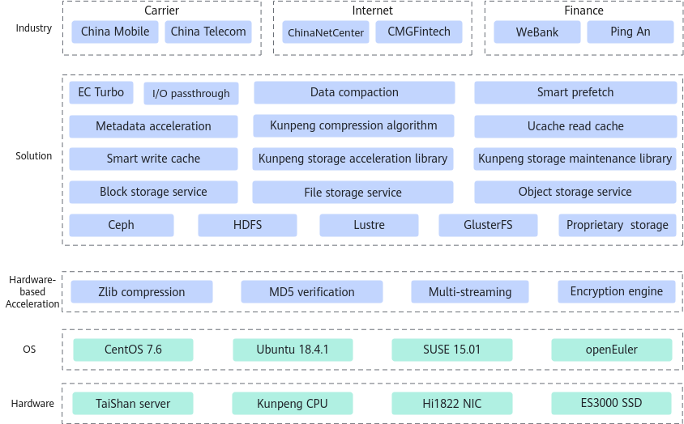

# BoostSDS Quick Start

## Latest Updates

- \[December 2025]: Enhanced the performance of RocksDB 6.1.2 using the metadata acceleration feature.
- \[March 2025]: Added the metadata acceleration feature.
- \[March 2025]: Added the SPDK I/O acceleration feature.
- \[December 2024]: Added the zstd algorithm to KSAL for compressing the metadata of 10 billion objects in Ceph object storage.
- \[December 2024]: Optimized encoding and decoding at the 6+3 ratio and 64-byte strip size in KSAL.
- \[December 2024]: Added the EC Turbo feature.
- \[September 2024]: Added the RDMA network acceleration feature.
- \[September 2024]: Added the KAE-enabled SPDK feature.
- \[September 2024]: Added support for encoding and decoding at the K+1, K+2, K+3, K+4 (2 ≤ K ≤ 25), and 28+3 ratios, as well as 64-byte and 4096-byte strip sizes in the KSAL EC algorithm.
- \[June 2024]: Added encoding types such as EC 8+2, 8+3, and 25+4 to KSAL, improving encoding performance by over 50% compared to the open-source version.
- \[January 2024]: Added support for encoding and decoding at the 64-byte strip size in the KSAL EC algorithm.
- \[October 2023]: Added the KSAL feature, which supports the EC, CRC16 T10DIF, and CRC32C algorithms.

## Project Introduction

1.1 Overview

Kunpeng BoostKit for Software-Defined Storage (SDS) leverages the Kunpeng hardware platform. With in-house processors, NICs, SSDs, management chips, and AI chips, this solution provides customers with block storage, file storage, and object storage services based on open-source Ceph distributed storage software. The overall architecture of Kunpeng BoostKit for SDS consists of the hardware platform, OSs, middleware, and distributed storage software. Currently, only open-source Ceph is supported.

1.2 Architecture

1.3 Community Homepage

[Kunpeng Community - Kunpeng BoostKit for SDS](https://www.hikunpeng.com/document/detail/en/kunpengsdss/overview/kunpengsdss.html)

## Feature Description

### EC Turbo

- The EC Turbo feature optimizes the erasure coding (EC) process of Ceph and reduces I/O amplification in data read/write. The EC performance is improved by more than 30% compared with that of the open-source Ceph EC algorithm.
- [https://gitcode.com/boostkit/ceph](https://gitcode.com/boostkit/ceph)

### KSAL

KSAL is a Huawei-developed storage algorithm library. It uses algorithms optimized based on Kunpeng instead of mainstream open-source algorithms to improve storage performance.

- EC encoding and decoding
  - The vectorized EC encoding and decoding scheme replaces the high-order finite field multiplication of traditional scalar encoding with low-order binary XOR operations and reuses intermediate calculation results through encoding orchestration to reduce the number of operations.
  - Compared with mainstream open-source EC algorithms, the average encoding throughput is doubled.
- CRC16 verification
  - CRC16 optimized based on the Kunpeng platform and a large-number modulo algorithm is used to replace the standard CRC16 implementation. This enhancement provides better Kunpeng affinity, improving system performance.
  - Compared with mainstream open-source CRC16 algorithms, the 4 KB verification performance of this algorithm is doubled.
- CRC32 verification
  - The CRC32 algorithm optimized based on the Kunpeng platform is used to replace the standard CRC32 algorithm, improving system performance.
  - The CPU computing power consumed by a single I/O operation is reduced by more than 50%, and the overall gain is estimated to be 3%. When the block size is 4 KB, 8 KB, 64 KB, 256 KB, or 1 MB, the performance is twice that of ceph_crc32c_sctp and 1.2 times that of ceph_crc32_sctp.
- \[To be open sourced]

### Metadata Acceleration

- Metadata acceleration is a storage engine acceleration feature developed by Huawei and optimized based on RocksDB.
  - RocksDB
    RocksDB is a high-performance, persistent, and embedded key-value storage engine developed by Facebook. It is widely used in large-scale data storage and processing, such as Internet services, distributed systems, and data analysis services. Based on RocksDB, the metadata acceleration feature uses a Huawei-developed algorithm to enable Kunpeng acceleration for better storage performance. This feature fits well with the Kunpeng architecture to optimize read and write hotspots, adjust background tasks (data flushing and compaction) based on service loads, and optimize cache logic based on data hotspots.
  - [https://gitcode.com/boostkit/rocksdb](https://gitcode.com/boostkit/rocksdb)

### Ucache Smart Read Cache

- The Ucache smart read cache uses smart I/O prefetch to accurately identify hotspot requests, prefetch I/Os of the sequential pattern, interleaved pattern and more, and load I/Os to the read cache in advance. In addition, it uses the LRU algorithm to evict cold data, improving the I/O hit ratio and read performance.
- [https://gitcode.com/boostkit/ocf](https://gitcode.com/boostkit/ocf)

### Data Compaction

- The data compaction algorithm is deployed on an open-source Ceph cluster to eliminate data waste caused by zero padding. In addition, combined with functions including data encapsulation, space allocation based on block counting, granularity-based traffic division, batch submission, and batch callback, the data compaction algorithm improves the data reduction ratio and overall system IOPS, which reduces costs and improves performance.
- [https://gitcode.com/boostkit/ceph](https://gitcode.com/boostkit/ceph)

### RDMA Network Acceleration

- A plugin is applied to the Ceph network framework AsyncMessenger to support Unified Communication X (UCX), which enables full RDMA in Ceph all-flash storage.
- [https://gitcode.com/boostkit/ceph](https://gitcode.com/boostkit/ceph)

### KAE-enabled SPDK

- As the virtual device layer, the Storage Performance Development Kit block device (SPDK bdev) interconnects with underlying virtual and physical devices. By enabling compression, encryption, and decryption in the bdev, all SPDK devices can support these features.
- [https://gitcode.com/boostkit/spdk](https://gitcode.com/boostkit/spdk)

### SPDK I/O Acceleration

- A Ceph cluster is deployed in containers on Kunpeng servers running openEuler 20.03. The integration of the SPDK, UCX, and KSAL maximizes storage and network performance, answering the need for high throughput and low latency in modern distributed storage.
- [https://gitcode.com/boostkit/ceph](https://gitcode.com/boostkit/ceph)

## About the Community

This part provides the introduction and guidance to the public modules, such as the community governance architecture, SIG operations regulations, contribution, email subscription, and social media contact information.

## Contributions, Suggestions, and Discussions

We welcome your contributions to the community. If you have any questions/suggestions or want to provide feedback on feature requirements and bug reports, you can [submit issues](https://gitcode.com/boostkit/community/blob/master/docs/contributor/issue-submit.md). For details, see the [contribution guideline](https://gitcode.com/boostkit/community/blob/master/docs/contributor/contributing.md). You are also welcome to share insights in the [Discussions](https://gitcode.com/boostkit/community/discussions). Thank you for your support.

## License

The documents of this project are licensed under CC-BY 4.0. For details, see the [license file](LICENSE-DOCS).
